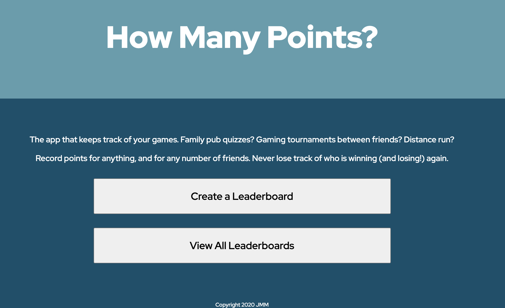

# How Many Points App

Initially created as Group Project - full stack app using Spring backend and React front end.

Refactored to different concept and design as personal project following CodeClan.

The app allows users to created Leaderboards for whatever they need to - whether this is family pub quizzes they're having over Zoom, games console tournaments against friends, or tracking the number of kilometres they've run versus their friends.

The backend is built using Spring, and is deployed on Heroku. The frontend is built in React, deployed on Zeit Now, accessing the JSON API on the backend.

App can be viewed via: https://java-group-project-spring-react.jenmerritt.now.sh

A user can create, manage and delete a leaderboard. There is no user authentication, instead, a timestamp is collected when a leaderboard is created and used to create a unique URL that can be used for administration purposes. Leaderboards also come with a "read-only" URL that they can share with friends/family. Additionally, the administration URL could be shared with multiple people if desired. This decision was made for a) flexibility of administration and b) to save the time needed of a user signing up. This admin URL has to be bookmarked to remember, and this messaging is clear when the user creates their leaderboard. Via the admin URL, the user can also add players, manage points and delete players.

## Additional feature plans:

- Create a "Scoresheet" feature, that enables a 1 off scoresheet to be created, for example to track points while playing a board game. This would complement the existing Leaderboard functionality and be added as an additional component.
- Create tutorial video for using the app
- Develop a React Native version for use on mobile devices
- Deploy independently of Heroku / Zeit Now e.g. on AWS
